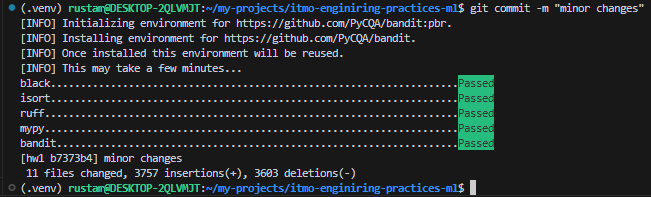
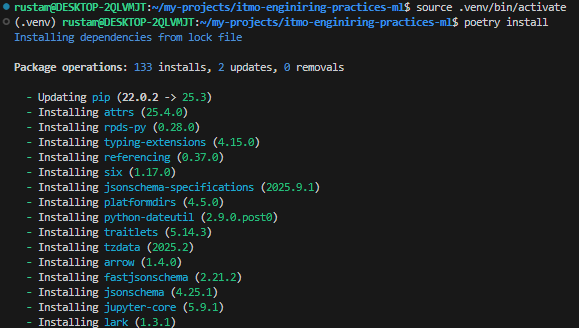
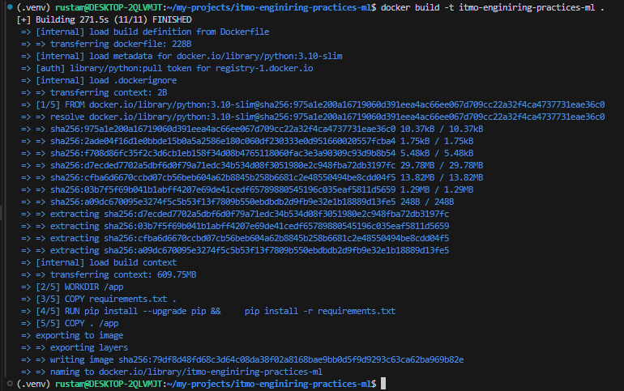
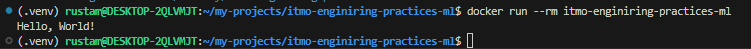

# itmo-engineering-practices-ml

<a target="_blank" href="https://cookiecutter-data-science.drivendata.org/">
    
</a>

Template for course engineering-practices-ml

## Project Organization

```
├── LICENSE            <- Open-source license if one is chosen
├── Makefile           <- Makefile with convenience commands like `make data` or `make train`
├── README.md          <- The top-level README for developers using this project.
├── Dockerfile         <- Dockerfile boilerplate  
├── data
│   ├── external       <- Data from third party sources.
│   ├── interim        <- Intermediate data that has been transformed.
│   ├── processed      <- The final, canonical data sets for modeling.
│   └── raw            <- The original, immutable data dump.
│
├── docs               <- A default mkdocs project; see www.mkdocs.org for details
│
├── models             <- Trained and serialized models, model predictions, or model summaries
│
├── notebooks          <- Jupyter notebooks. Naming convention is a number (for ordering),
│                         the creator's initials, and a short `-` delimited description, e.g.
│                         `1.0-jqp-initial-data-exploration`.
│
├── pyproject.toml     <- Project configuration file with package metadata for 
│                         src and configuration for tools like black
│
├── references         <- Data dictionaries, manuals, and all other explanatory materials.
│
├── reports            <- Generated analysis as HTML, PDF, LaTeX, etc.
│   └── figures        <- Generated graphics and figures to be used in reporting
│
├── requirements.txt   <- The requirements file for reproducing the analysis environment, e.g.
│                         generated with `pip freeze > requirements.txt`
│
├── setup.cfg          <- Configuration file for flake8
│
└── src   <- Source code for use in this project.
    │
    ├── __init__.py             <- Makes src a Python module
    │
    ├── config.py               <- Store useful variables and configuration
    │
    ├── dataset.py              <- Scripts to download or generate data
    │
    ├── features.py             <- Code to create features for modeling
    │
    ├── modeling                
    │   ├── __init__.py 
    │   ├── predict.py          <- Code to run model inference with trained models          
    │   └── train.py            <- Code to train models
    │
    └── plots.py                <- Code to create visualizations
```


# Отчет о настройке рабочего места Data Scientist (ДЗ1)

## 1. Структура проекта
- Использован [Cookiecutter Data Science](https://cookiecutter-data-science.drivendata.org/)
  ```bash
    pip install cookiecutter-data-science
    ccds https://github.com/drivendataorg/cookiecutter-data-science
  ```
- Созданы папки: src, notebooks, tests итд
- Добавлен README.md


## 2. Качество кода
- Настроены pre-commit hooks: Black, isort, Ruff, MyPy, Bandit
  ```
  pre-commit install
  ```
- Создан pyproject.toml
- Выполнены тестовые коммиты
   

## 3. Управление зависимостями
- Использован Poetry
  * Команды
    ```
    python3 -m venv .venv
    source .venv/bin/activate
    poetry install
    poetry install --with dev
    ```

  * Установка зависимостей через poetry
  
- Создан Dockerfile
  * Команды
    ```
    docker build -t itmo-engineering-practices-ml .
    docker run --rm itmo-engineering-practices-ml
    ```
  * Пример сборки
  
  * Запуск и уничтожение контейнера
  

- Сформирован requirements.txt
    ```
    poetry export -f requirements.txt --output requirements.txt --without-hashes
    ```

## 4. Git workflow
- **Инициализация:** Настроен Git репозиторий, создан `.gitignore` для Python/ML проектов (исключены venv, __pycache__, модели, raw data).
- **Стратегия ветвления (Branching Strategy):**
  В проекте используется подход **Feature Branch Workflow**:
  1.  **`master`:** Основная ветка. Содержит только стабильный, протестированный код. Прямые коммиты в master запрещены (protected branch).
  2.  **`hw<номер>` (например, `hw1`):** Ветки для выполнения домашних заданий. Отделяются от `master`. После выполнения задания и прохождения тестов, ветка сдается на проверку (или вливается в master через Pull Request).
  3.  **`feature/<название>`:** Для разработки новых фич (например, `feature/add-preprocessing`).
  4.  **`fix/<название>`:** Для исправления багов.
- **Процесс работы:**
  - Создание ветки под задачу.
  - Регулярные атомарные коммиты с понятными сообщениями ([Conventional Commits](https://www.conventionalcommits.org/en/v1.0.0/)).
  - Использование pre-commit хуков перед коммитом.
  - Слияние в основную ветку через Pull Request (Merge Request) после код-ревью.

--------

