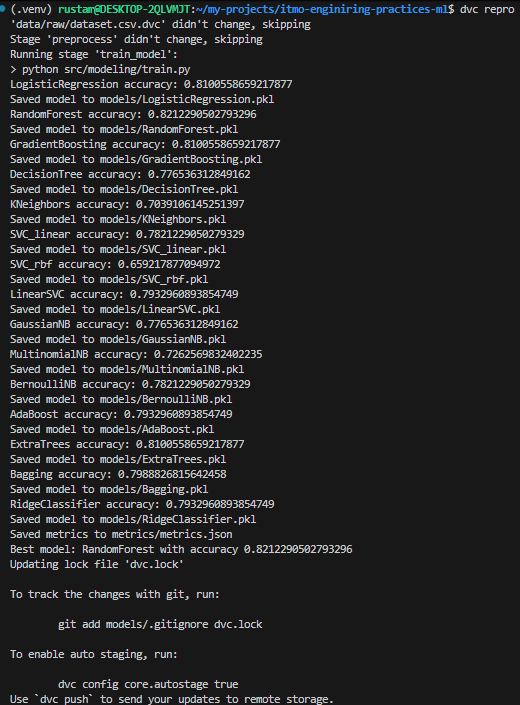
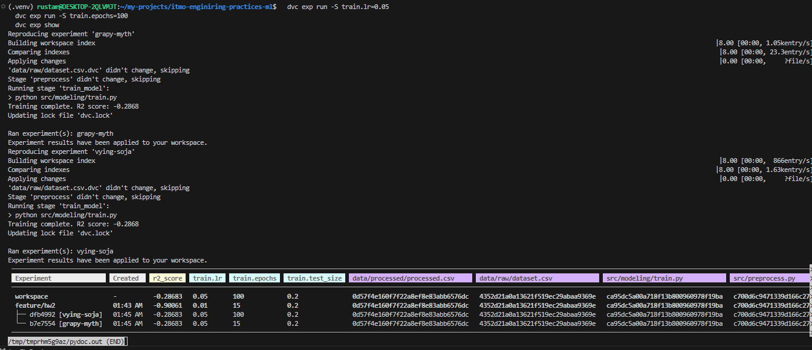
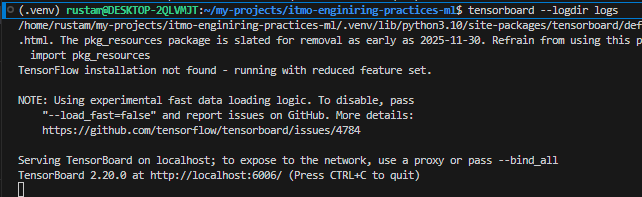
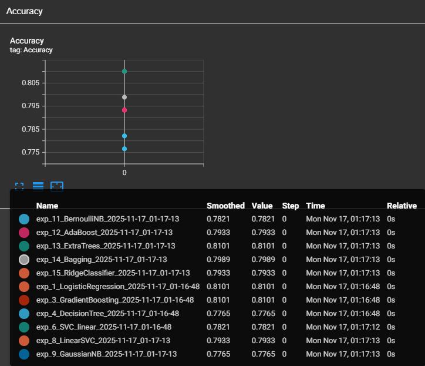
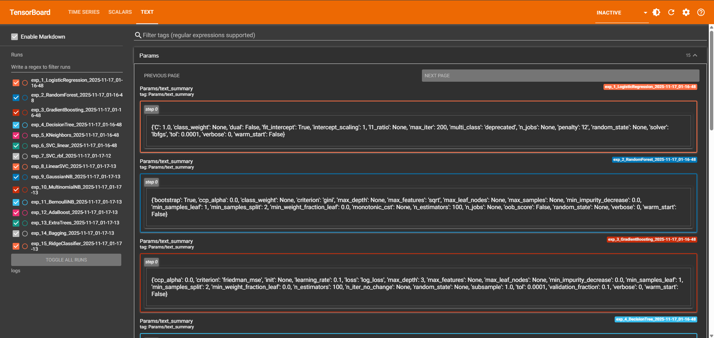

# itmo-enginiring-practices-ml

<a target="_blank" href="https://cookiecutter-data-science.drivendata.org/">
    
</a>

Template for course enginiring-practices-ml

## Project Organization

```
Directory structure:
└── akirusprod-itmo-enginiring-practices-ml/
    ├── README.md
    ├── Dockerfile
    ├── dvc.lock
    ├── dvc.yaml
    ├── LICENSE
    ├── Makefile
    ├── params.yaml
    ├── pyproject.toml
    ├── requirements.txt
    ├── .dvcignore
    ├── .pre-commit-config.yaml
    ├── data/
    │   └── raw/
    │       └── dataset.csv.dvc
    ├── docs/
    │   ├── README.md
    │   ├── mkdocs.yml
    │   ├── .gitkeep
    │   └── docs/
    │       ├── getting-started.md
    │       └── index.md
    ├── metrics/
    │   └── metrics.json
    ├── models/
    │   └── .gitkeep
    ├── notebooks/
    │   └── .gitkeep
    ├── references/
    │   └── .gitkeep
    ├── reports/
    │   ├── .gitkeep
    │   └── figures/
    │       └── .gitkeep
    ├── src/
    │   ├── __init__.py
    │   ├── config.py
    │   ├── preprocess.py
    │   ├── train.py
    │   └── utils.py
    ├── tests/
    │   └── test_data.py
    └── .dvc/
        └── config
```


# Отчет по трекину экспериментов (ДЗ3)

Прежде всего добавим tensorboard к стеку dvc. Также я решил взять датасет побольше - [Titanic Dataset](https://www.kaggle.com/competitions/titanic/data). 

## 1. Настройка выбранного инструмента (Tensorboard)
- Установка и инициализация
    ```
    poetry add tensorboard
    poetry add tensorboardX
    ```
    Логировать будем в logs
- Закинем titanic датасет
    ```
    ├── data/
    │   └── raw/
    |       └── dataset.csv     
    ```


- Настройка remote storage (Local)
    ```
    mkdir localstore
    mkdir dvc_storage
    dvc remote add -d localstore dvc_storage
    git add .dvc/config
    git commit -m "Set DVC remote (local)"
    ```
    


### 1.1. Версионирование моделей и данных в DVC
- Конфиг со стейджами для версионирования `dvc.yaml` в DVC:
    ```yaml
        stages:
        preprocess:
            cmd: python src/preprocess.py
            deps:
            - data/raw/dataset.csv
            - src/preprocess.py
            outs:
            - data/processed
        train_model:
            cmd: python src/train.py
            deps:
            - data/processed/processed.csv
            - src/train.py
            - src/config.py
            - src/utils.py
            - src/preprocess.py
            params:
            - train.test_size
            - train.seed
            outs:
            - models/LogisticRegression.pkl
            - models/RandomForest.pkl
            - models/GradientBoosting.pkl
            - models/DecisionTree.pkl
            - models/KNeighbors.pkl
            - models/SVC_linear.pkl
            - models/SVC_rbf.pkl
            - models/LinearSVC.pkl
            - models/GaussianNB.pkl
            - models/MultinomialNB.pkl
            - models/BernoulliNB.pkl
            - models/AdaBoost.pkl
            - models/ExtraTrees.pkl
            - models/Bagging.pkl
            - models/RidgeClassifier.pkl

            metrics:
            - metrics/metrics.json:
                cache: false


    ```
    Выполнение:
    ```
    dvc repro
    ```
    

- Сравнение версий модели.
  ```
    dvc exp run -S train.test_size=0.3
    dvc metrics diff
    dvc exp show
  ```
  

## 2. Проведение экспериментов 
- Запуск Тензорборда осуществляется командой:
    ```
    tensorboard --logdir logs
    ```
    
- Если перейти по ссылке, то можно увидеть
    
- Параметры также логируются
    
- Проведено 15 экспериментов с разными алгоритмами
- Логирование метрик осуществляется через tensorboard, параметры и артефакты через dvc.
- Сравнивать, фильтровать и искать информацию можно средствами tensorboard.

## 3.	Интеграция с кодом:
Инструмент логирования интегрирован в код через `src/utils.py`, в виде декораторов и контекстных менеджеров. Испольузется непосредственно в `train.py`
Пример встраивания:
```python
@log_experiment()
def train_model(name, model, X_train, y_train, X_val, y_val, writer=None):
    model.fit(X_train, y_train)
    preds = model.predict(X_val)
    acc = accuracy_score(y_val, preds)

    writer.add_scalar("Accuracy", acc, 0)
    writer.add_text("Params", str(model.get_params()), 0)

    save_model(model, f"{MODEL_DIR}/{name}.pkl")
    return acc
```

