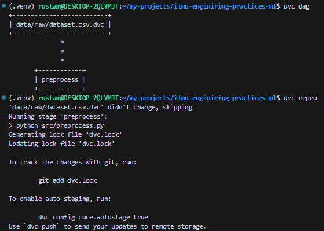
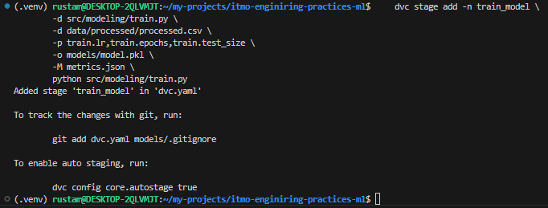
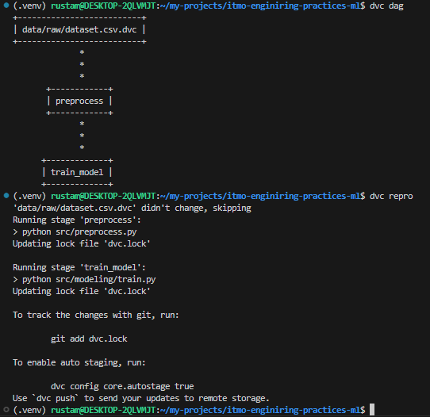
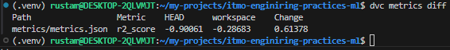
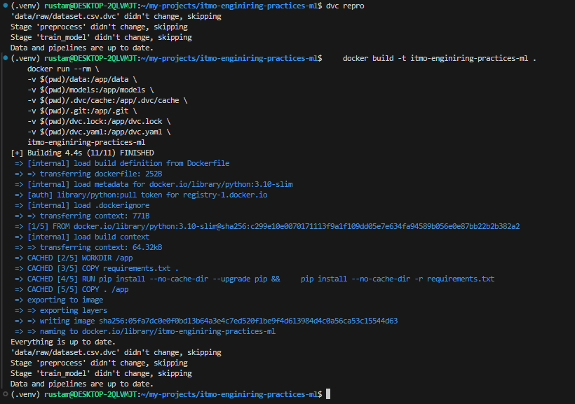

# itmo-enginiring-practices-ml

<a target="_blank" href="https://cookiecutter-data-science.drivendata.org/">
    
</a>

Template for course enginiring-practices-ml

## Project Organization

```
Directory structure:
└── akirusprod-itmo-enginiring-practices-ml/
    ├── README.md
    ├── Dockerfile
    ├── dvc.lock
    ├── dvc.yaml
    ├── LICENSE
    ├── Makefile
    ├── params.yaml
    ├── pyproject.toml
    ├── requirements.txt
    ├── .dvcignore
    ├── .pre-commit-config.yaml
    ├── data/
    │   └── raw/
    │       └── dataset.csv.dvc
    ├── docs/
    │   ├── README.md
    │   ├── mkdocs.yml
    │   ├── .gitkeep
    │   └── docs/
    │       ├── getting-started.md
    │       └── index.md
    ├── models/
    │   └── .gitkeep
    ├── notebooks/
    │   └── .gitkeep
    ├── references/
    │   └── .gitkeep
    ├── reports/
    │   ├── .gitkeep
    │   └── figures/
    │       └── .gitkeep
    ├── src/
    │   ├── __init__.py
    │   ├── preprocess.py
    │   └── modeling/
    │       ├── __init__.py
    │       └── train.py
    ├── tests/
    │   └── test_data.py
    └── .dvc/
        └── config
```


# Отчет по версионированию данных и моделей (ДЗ2)


## 1. Настройка версионирования данных (DVC)
- Установка и инициализация
    ```
    poetry add dvc
    dvc init
    ```
    
- Настройка remote storage (Local)
    ```
    mkdir localstore
    mkdir dvc_storage
    dvc remote add -d localstore dvc_storage
    git add .dvc/config
    git commit -m "Set DVC remote (local)"
    ```
    

- Версионирование данных
    
    В качестве датасета был взят https://www.kaggle.com/datasets/crawford/80-cereals и переименован в `dataset.csv`
    ```
    dvc add data/raw/dataset.csv
    git add data/raw/dataset.csv.dvc .gitignore
    git commit -m "Versioned dataset"
    ```
    
- Автоматическое создание версий
    ```
    dvc stage add -n preprocess \
    -d src/preprocess.py \
    -d data/raw/dataset.csv \
    -o data/processed \
    python src/preprocess.py
    ```
    
    ```
    dvc dag
    dvc repro
    ```
    
## 2. Версионирование моделей в DVC
- Написание `src/modeling/train.py`, `params.yaml` и создание DVC stage:
    ```
    dvc stage add -n train_model \
        -d src/modeling/train.py \
        -d data/processed/processed.csv \
        -p train.lr,train.epochs,train.test_size \
        -o models/model.pkl \
        -M metrics.json \
        python src/modeling/train.py
    ```
    
    ```
    dvc dag
    dvc repro
    ```
    

- Сравнение версий модели.
  ```
    dvc exp run -S train.lr=0.05
    dvc exp run -S train.epochs=100
    dvc exp show
  ```
  
- Другой вариант
    ```
    dvc metrics diff
    ```
  

## 3. Воспроизводимость
- Версии уже зафиксированы
  ```
  poetry lock
  poetry export -f requirements.txt --output requirements.txt --without-hashes
  ```
- Инструкция по воспроизведению
  ```
    git clone --branch feature/hw2 https://github.com/AkiRusProd/itmo-enginiring-practices-ml.git
    pip install -r requirements.txt
    dvc pull
    dvc repro
  ```
- Или в контейнере
    ```
    docker build -t itmo-enginiring-practices-ml .
    docker run --rm \
    -v $(pwd)/data:/app/data \
    -v $(pwd)/models:/app/models \
    -v $(pwd)/.dvc/cache:/app/.dvc/cache \
    -v $(pwd)/.git:/app/.git \
    -v $(pwd)/dvc.lock:/app/dvc.lock \
    -v $(pwd)/dvc.yaml:/app/dvc.yaml \
    itmo-enginiring-practices-ml
    ```
    
    Ничего не изменилось