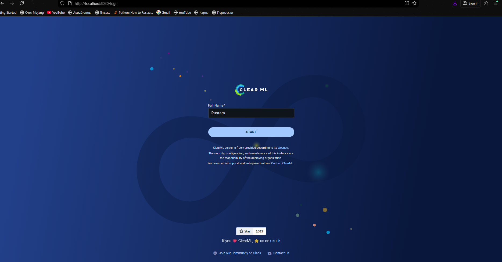
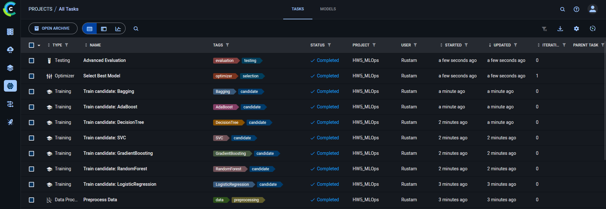
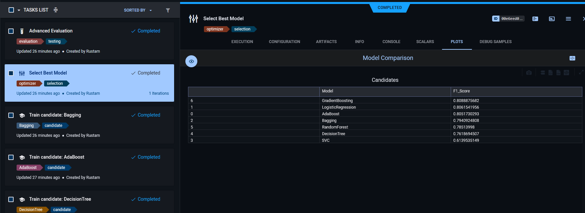
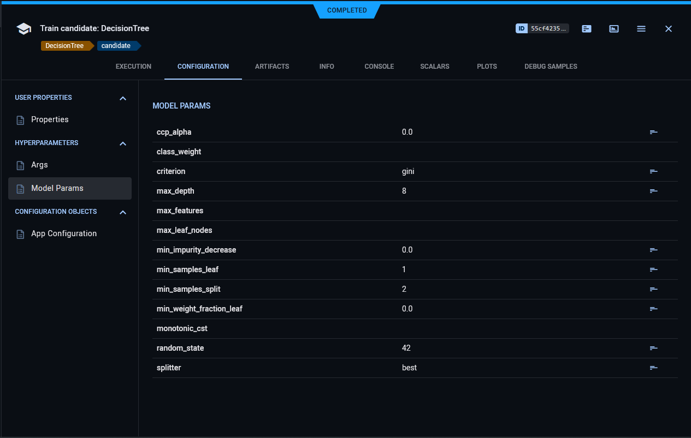
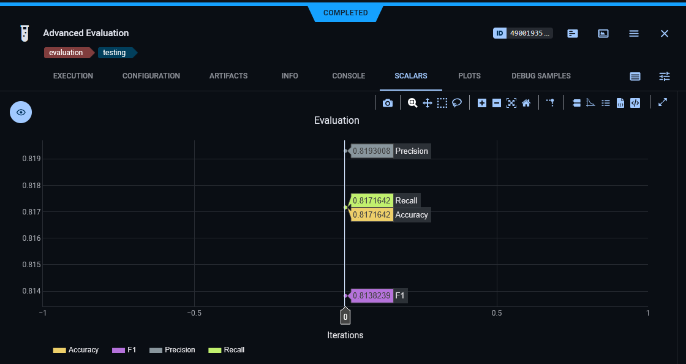
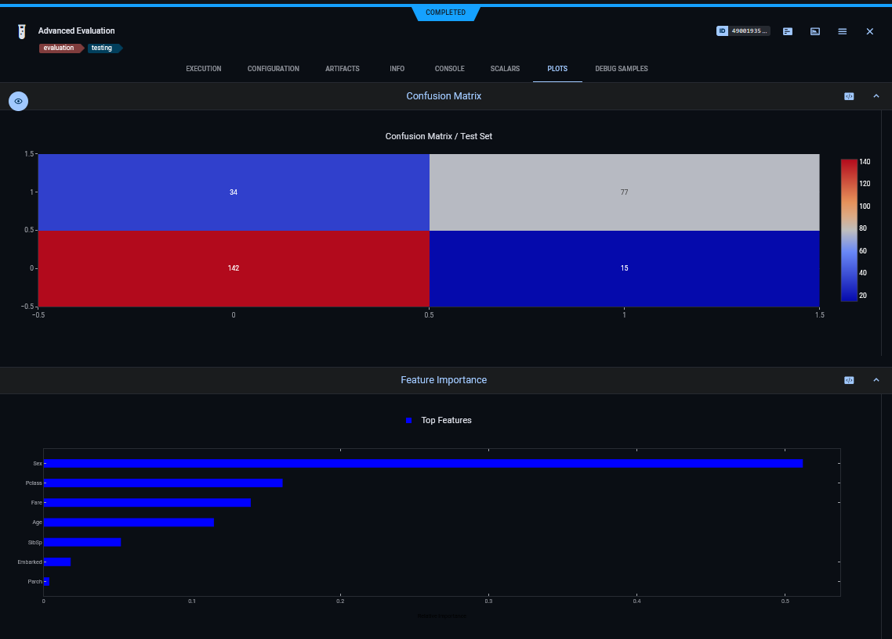
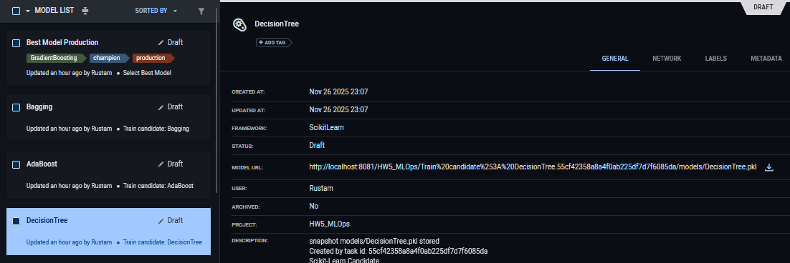
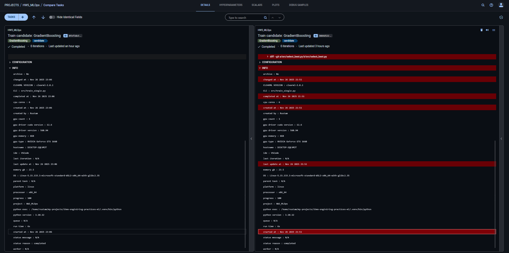
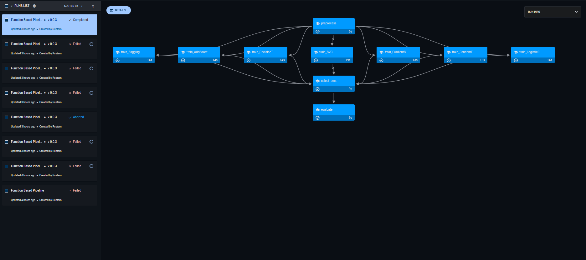
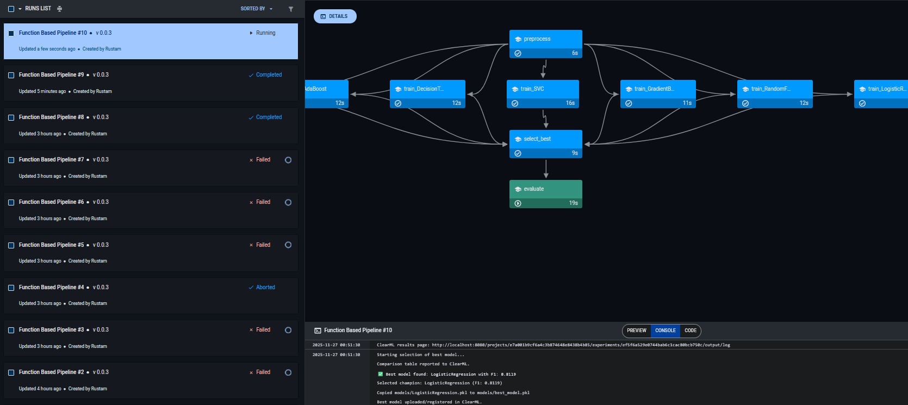

# itmo-enginiring-practices-ml

<a target="_blank" href="https://cookiecutter-data-science.drivendata.org/">
    
</a>

Template for course enginiring-practices-ml

## Project Organization

```
Directory structure:
└── akirusprod-itmo-enginiring-practices-ml/
    ├── README.md
    ├── Dockerfile
    ├── dvc.lock
    ├── dvc.yaml
    ├── LICENSE
    ├── Makefile
    ├── params.yaml
    ├── pyproject.toml
    ├── requirements.txt
    ├── .dvcignore
    ├── .pre-commit-config.yaml
    ├── config/
    │   ├── params.dev.yaml
    │   ├── params.prod.yaml
    │   └── params.test.yaml
    ├── data/
    │   └── raw/
    │       └── dataset.csv.dvc
    ├── docs/
    │   ├── README.md
    │   ├── mkdocs.yml
    │   ├── .gitkeep
    │   └── docs/
    │       ├── getting-started.md
    │       └── index.md
    ├── examples/
    │   └── config_composition_examples.py
    ├── notebooks/
    │   └── .gitkeep
    ├── references/
    │   └── .gitkeep
    ├── reports/
    │   ├── .gitkeep
    │   └── figures/
    │       └── .gitkeep
    ├── src/
    │   ├── __init__.py
    │   ├── base_config.py
    │   ├── config_manager.py
    │   ├── eval.py
    │   ├── preprocess.py
    │   ├── result_logger.py
    │   ├── schemas.py
    │   ├── select_best.py
    │   ├── train.py
    │   ├── train_single.py
    │   └── utils.py
    ├── tests/
    │   └── test_data.py
    └── .dvc/
        └── config
```


# Отчет по ClearML для MLOps (ДЗ5)

## 1.	Настройка ClearML (3 балла):
### 1.1 Установить и настроить ClearML Server
Установка и настройка:

1. Установку и запуск выполним через docker-compose:
    https://github.com/clearml/clearml-server/blob/master/docker/docker-compose.yml

2. Выдаем права на директорию для работы elastic-search.
    ```
    sudo chown -R 1000:1000 /opt/clearml/data/elastic_7
    sudo chmod -R 775 /opt/clearml/data/elastic_7
    ```

3. Запускаем контейнеры.
    ```
    docker compose -f docker-compose.clearml.yml up --build -d
    ```
4. Переходим по `http://localhost:8080`. После этого сервис должен запуститься:
    

5. Далее "Settings" -> "Workspace" -> "Create new credentials" (или просто http://localhost:8080/settings/workspace-configuration).

6. Не забываем поставить clearml в poetry: `poetry add clearml`

7. Далее создаем файл `.env` в корне проекта (Пример: [.env.example](.env.example)).


8. (Необязательный шаг, если не хотите использовать .env) Далее в cli с проектом пишем clearml-init. В директории юзера должен появиться `clearml.conf`
/home/rustam/clearml.conf

9. Перезапускаем контейнеры:
    ```
    docker compose -f docker-compose.clearml.yml down
    docker compose -f docker-compose.clearml.yml up -d
    ```

10. Дополнительно можно проверить, что все работает по адресу http://localhost:8008/debug.ping. Должны получить `result_msg	"OK"`.


### 1.2 Настроить базу данных и хранилище
Развернут локальный сервер, используя [docker-compose.clearml.yml](docker-compose.clearml.yml). В качестве БД используется MongoDB (контейнер clearml-mongo), в качестве хранилища артефактов настроен локальный файловый сервер (clearml-fileserver), персистентность данных обеспечена через Docker Volumes.


### 1.3	Создать проект и эксперименты
Внедрили clearml в каждый этап пайплайна [dvc.yaml](dvc.yaml) в [src/](src).



### 1.4	Настроить аутентификацию
Настроили в 1.1.1 (Креды берутся из `.env` (пример: [.env.example](.env.example))). 

## 2.	Трекинг экспериментов (3 балла):
### 2.1	Настроить автоматическое логирование
Методы логирования внедрены в каждый этап пайплана, поэтому метрики, артефакты, логи, параметры модели и т.д. логируются автоматически при запуске пайплана.

### 2.2	Создать систему сравнения экспериментов
В [select_best.py](src/select_best.py) генерируется и логируется сводная таблицу через `logger.report_table("Model Comparison", ...)` — это позволяет наглядно сравнивать модели прямо в UI. Кроме того в UI позволяет напрямую сравнивать эксперименты. Можно выделить и нажать "Compare".



### 2.3	Настроить логирование метрик и параметров
Параметры логируются через `task.connect(model.get_params())`. Метрики - через и `logger.report_scalar`.    
Пример логирования параметров модели:


Пример логирования метрик:



### 2.4	Создать дашборды для анализа
[eval.py](src/eval.py) создает Confusion Matrix и Feature Importance, которые отображаются в дашборде эксперимента:



## 3.	Управление моделями (3 балла):
### 3.1	Настроить регистрацию и версионирование моделей
Регистрация моделей реализована с использованием ClearML Model Registry. В скрипте обучения [train_single.py](src/train_single.py) каждая обученная модель сохраняется локально в формате `.pkl`, после чего автоматически загружается на сервер и регистрируется в эксперименте через метод:
```python
task.update_output_model(
    model_path=local_model_path,
    model_name=model_name,
    auto_delete_file=False
)
```
Это гарантирует, что каждый артефакт модели привязан к конкретному запуску эксперимента (Task ID). В интерфейсе ClearML все модели доступны в разделе **Models**, где можно скачать файл модели и посмотреть, какой эксперимент её породил.


###	3.2 Создать систему метаданных для моделей
Система метаданных реализована через автоматический захват конфигурации и явное логирование параметров:
*   **Гиперпараметры:** В [train_single.py](src/train_single.py) используется `task.connect(model.get_params(), name="Model Params")`, что автоматически привязывает гиперпараметры `sklearn` моделей к эксперименту.
*   **Тегирование:** Используется система тегов для классификации моделей по этапам жизненного цикла:
    *   `candidate`, `[ModelName]` — присваиваются всем обученным моделям на этапе обучения.
    *   `production`, `champion` — присваиваются выбранной лучшей модели в скрипте [select_best.py](src/select_best.py).
*   **Метрики:** Расширенные метрики (JSON) сохраняются и валидируются через Pydantic-схемы (`schemas.py`), обеспечивая единый стандарт метаданных.

###	3.3 Настроить автоматическое создание версий
Автоматическое версионирование обеспечивается платформой ClearML при каждом запуске пайплайна:
*   При каждом выполнении [train_single.py](src/train_single.py) создается новый эксперимент (Task).
*   Метод `task.update_output_model(..., auto_delete_file=False)` регистрирует файл `.pkl` в **Model Registry**.
*   ClearML автоматически присваивает уникальный ID и инкрементирует версию для каждой новой загруженной модели, сохраняя полную историю изменений и связь с кодом/параметрами, на которых модель была обучена.

###	3.4 Создать систему сравнения моделей
Реализована двухуровневая система сравнения:
1.  **Автоматическая (в пайплайне):** Скрипт [select_best.py](src/select_best.py) собирает метрики всех обученных кандидатов, формирует сводную таблицу `pandas` и отправляет её в ClearML через `logger.report_table("Model Comparison", ...)`. Это позволяет мгновенно увидеть лидера в отчете задачи.
2.  **Визуальная (в UI):** В интерфейсе ClearML настроено сравнение экспериментов (Experiment Comparison), позволяющее на одном графике сопоставить F1-score и гиперпараметры всех запущенных моделей-кандидатов.


## 4. Пайплайны (2 балла)

### 4.1 Создать ClearML пайплайны для ML workflow
Для оркестрации процесса обучения был разработан скрипт [pipeline_controller.py](src/pipeline_controller.py), использующий класс `clearml.automation.PipelineController`.
Реализован **Function-based Pipeline**, что позволяет напрямую использовать Python-функции из проекта в качестве шагов пайплайна, обеспечивая гибкость и быстрый цикл разработки.

Структура пайплайна (DAG) состоит из следующих этапов:
1.  **preprocess:** Подготовка данных (функция из [preprocess.py](src/preprocess.py)).
2.  **train_...:** Параллельный запуск обучения нескольких моделей (итерация по конфигу и запуск [train_single.py](src/train_single.py) для каждой модели).
3.  **select_best:** Сбор метрик и выбор лучшей модели ([select_best.py](src/select_best.py)).
4.  **evaluate:** Финальная оценка чемпиона на отложенной выборке ([eval.py](src/eval.py)).

Данные между шагами передаются через систему **ClearML Artifacts**: предобработанный датасет и файлы моделей загружаются в облачное хранилище и автоматически скачиваются на следующих шагах.


### 4.2 Настроить автоматический запуск пайплайнов
Запуск пайплайна инициируется через контроллер. В коде настроена очередь выполнения:
```python
pipe.set_default_execution_queue("default")
```
Для текущей демонстрации используется режим `pipe.start_locally(run_pipeline_steps_locally=True)`, который позволяет контроллеру немедленно выполнить все шаги на текущей машине, имитируя работу агента. В продакшн-среде достаточно убрать флаг `locally`, и задачи будут автоматически распределены между доступными ClearML агентами (Workers).

### 4.3 Создать систему мониторинга выполнения
Мониторинг осуществляется через веб-интерфейс ClearML в разделе **Pipelines**. Система предоставляет:
*   **Визуализацию DAG:** Наглядный граф зависимостей, где цветовая индикация (зеленый/красный/синий) показывает статус каждого шага в реальном времени.
*   **Логирование:** Полный доступ к консольному выводу (stdout/stderr) каждого отдельного шага по клику на узел графа.
*   **Отслеживание времени:** Тайминги выполнения каждого этапа и всего пайплайна целиком.



### 4.4 Настроить уведомления
Уведомления настроены на уровне платформы ClearML. Пайплайн-контроллер автоматически транслирует статусы выполнения (`Completed`, `Failed`, `Aborted`).
В настройках профиля ClearML (Settings -> Notifications) активированы оповещения, которые срабатывают при изменении статуса пайплайна (например, при падении одного из шагов обучения или успешном завершении всего цикла). Это позволяет оперативно реагировать на ошибки без необходимости постоянного наблюдения за консолью.

## 5.	Отчет о проделанной работе (1 балл):
###	5.1 Создать отчет в формате Markdown
Выполнено
###	5.2 Описать настройку каждого инструмента
Выполнено
###	5.3 Добавить скриншоты результатов
Выполнено
###	5.4 Сохранить отчет в Git репозитории
Выполнено


