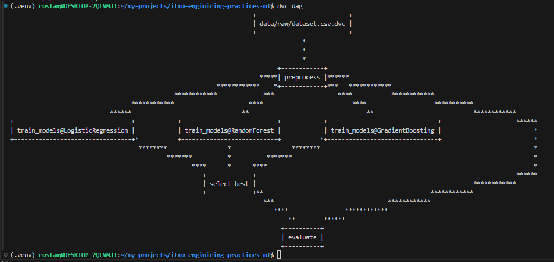
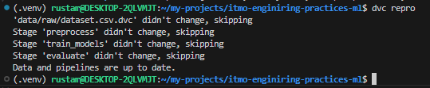
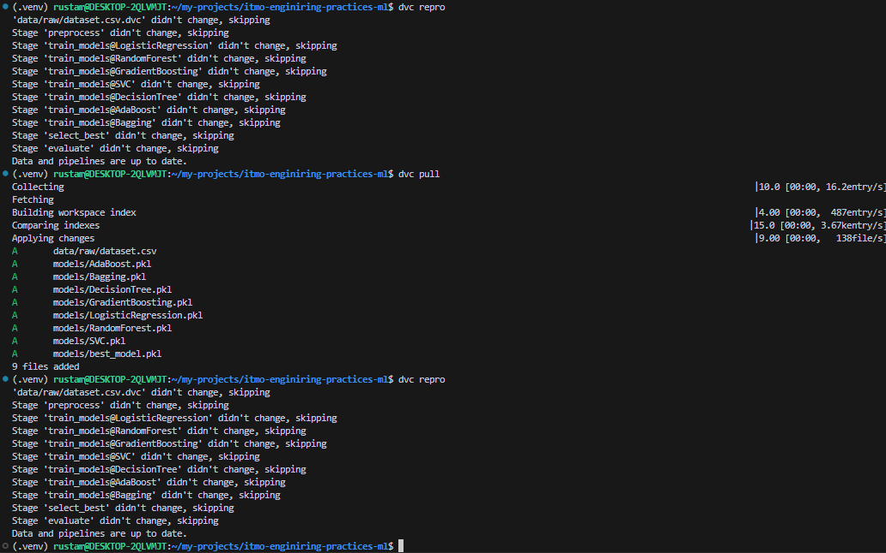

# itmo-enginiring-practices-ml

<a target="_blank" href="https://cookiecutter-data-science.drivendata.org/">
    
</a>

Template for course enginiring-practices-ml

## Project Organization

```
Directory structure:
└── akirusprod-itmo-enginiring-practices-ml/
    ├── README.md
    ├── Dockerfile
    ├── dvc.lock
    ├── dvc.yaml
    ├── LICENSE
    ├── Makefile
    ├── params.yaml
    ├── pyproject.toml
    ├── requirements.txt
    ├── .dvcignore
    ├── .pre-commit-config.yaml
    ├── config/
    │   ├── params.dev.yaml
    │   ├── params.prod.yaml
    │   └── params.test.yaml
    ├── data/
    │   └── raw/
    │       └── dataset.csv.dvc
    ├── docs/
    │   ├── README.md
    │   ├── mkdocs.yml
    │   ├── .gitkeep
    │   └── docs/
    │       ├── getting-started.md
    │       └── index.md
    ├── examples/
    │   └── config_composition_examples.py
    ├── notebooks/
    │   └── .gitkeep
    ├── references/
    │   └── .gitkeep
    ├── reports/
    │   ├── .gitkeep
    │   └── figures/
    │       └── .gitkeep
    ├── src/
    │   ├── __init__.py
    │   ├── base_config.py
    │   ├── config_manager.py
    │   ├── eval.py
    │   ├── preprocess.py
    │   ├── result_logger.py
    │   ├── schemas.py
    │   ├── select_best.py
    │   ├── train.py
    │   ├── train_single.py
    │   └── utils.py
    ├── tests/
    │   └── test_data.py
    └── .dvc/
        └── config
```


# Отчет по автоматизации пайплайнов (ДЗ4)

## 1.	Настройка выбранного инструмента оркестрации (4 балла):
### 1.1 Установить и настроить выбранный инструмент   
DVC уже установлен и настроен (см. ДЗ 2 и 3). 

### 1.2 Создать workflow для ML пайплайна
Был расширен workflow в dvc.py до 3-х этапов: preprocess, train_models, evaluate. Также была реализована более гибкая логика подбора параметров из params.py

### 1.3	Настроить зависимости между этапами
Зависимости данных также настроены в dvc.py. Рассмотреть граф зависимостей этапов пайплана можно через `dvc dag`:   


### 1.4	Реализовать кэширование и параллельное выполнение
DVC автоматически кэширует результаты каждого этапа, если:
- этап имеет deps: (зависимости)
- этап имеет outs: (выходы)     

Таким образом, в dvc-пайплайне уже реализовано кэширование:


DVC предоставляет параллельное выполнение стадий пайплаина через `dvc exp run --jobs`. DVC анализирует граф зависимостей. Стадии, которые не зависят друг от друга, выполняются параллельно. Максимальное количество параллельных задач задается через `--jobs`. Однако от себя добавлю, что кажется, что настоящей параллельности в dvc нет, потому что даже независимые пайплайны пишут в один dvc.lock, из-за чего делают они это последовательно.

## 2. Настройка выбранного инструмента конфигураций (3 балла):
### 1.1 Настроить выбранный инструмент для управления конфигурациями
Реализована система ConfigManager на основе Pydantic с поддержкой профилей dev/test/prod (см. [src/config_manager.py](src/config_manager.py)).

### 1.2 Создать конфигурации для разных алгоритмов
Созданы 3 файла конфигураций (params.dev.yaml, params.test.yaml, params.prod.yaml) с оптимизированными параметрами для разных мль алгоритмов (см. [config/](config/)).

### 1.3 Настроить валидацию конфигураций
Все параметры конфигурации проходят типизацию и кастомную валидацию через Pydantic схемы с проверкой диапазонов и форматов данных (см. [src/schemas.py](src/schemas.py)).
### 1.4 Создать систему композиции конфигураций
Реализована многоуровневая иерархия конфигураций (переменные окружения → профили → базовый конфиг) с методами слияния и переопределения параметров через merge() и override_model_params() (см. [src/config_manager.py](src/config_manager.py)).


## 3. Интеграция и тестирование (2 балла)

### 3.1 Интегрировать выбранные инструменты
Интеграция завершена:
- ConfigManager + DVC pipeline полностью интегрированы
- train.py использует ConfigManager для загрузки конфигураций
- DVC пайплайн (dvc.yaml) использует python3 команды
- Все профили (dev/test/prod) работают через переменную `CONFIG_PROFILE` в dvc.yaml.

### 3.2 Создать систему мониторинга выполнения
Реализована в `src/result_logger.py`:
- **PipelineLogger** класс для логирования каждого этапа
- Логи сохраняются в `logs/train_YYYYMMDD_HHMMSS.log`
- Вывод одновременно в консоль и в файл
- Информация о начале/окончании каждого этапа

### 3.3 Настроить уведомления о результатах
Система уведомлений реализована:
- Результаты выводятся в консоль
- Результаты сохраняются в `logs/results_YYYYMMDD.log`
- JSON метрики в `metrics/metrics.json`
- Красивый вывод лучшей модели и всех результатов

### 3.4 Протестировать воспроизводимость
Воспроизводимость поддержана:


## 4. Отчет о проделанной работе (1 балл)
### 1.1	Создать отчет в формате Markdown
Выполнено
### 1.2	Описать настройку выбранных инструментов
Выполнено
### 1.3	Добавить скриншоты результатов
Выполнено
### 1.4	Сохранить отчет в Git репозитории
Выполнено

