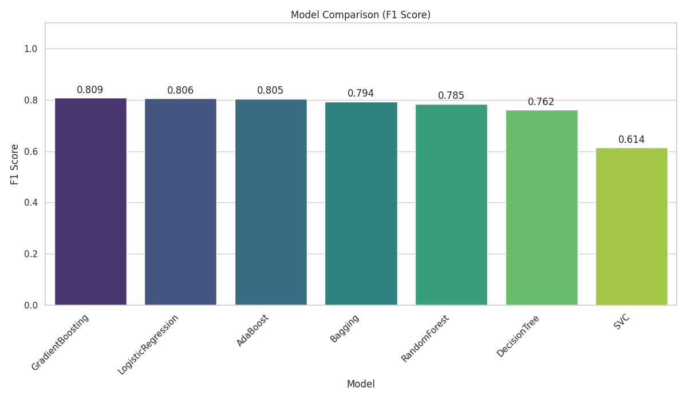
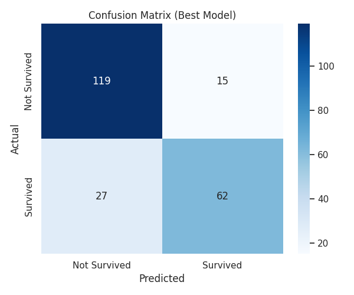

# Experiment Report

*Generated on: 2025-11-29 00:52*

## 1. Model Leaderboard

| Model              |   F1 Score | Timestamp                  | Profile   |
|:-------------------|-----------:|:---------------------------|:----------|
| GradientBoosting   |   0.808888 | 2025-11-29T00:50:09.701166 | test      |
| LogisticRegression |   0.806154 | 2025-11-29T00:49:35.799247 | test      |
| AdaBoost           |   0.805173 | 2025-11-29T00:50:59.062012 | test      |
| Bagging            |   0.794092 | 2025-11-29T00:51:15.312809 | test      |
| RandomForest       |   0.78514  | 2025-11-29T00:49:53.030606 | test      |
| DecisionTree       |   0.761869 | 2025-11-29T00:50:42.856761 | test      |
| SVC                |   0.613954 | 2025-11-29T00:50:26.695022 | test      |

## 2. Best Model Detailed Evaluation

| Metric | Value |
|--------|-------|
| **F1 Score** | 0.8089 |
| Accuracy | 0.8117 |
| Precision | 0.8111 |
| Recall | 0.8117 |

### Confusion Matrix

